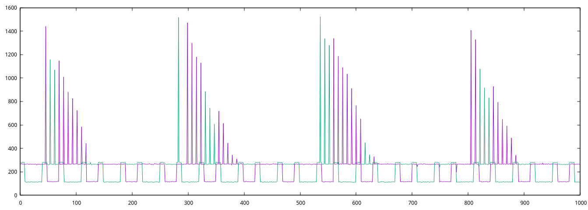
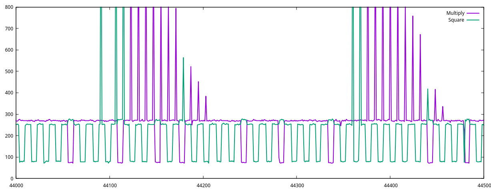

# Assignment 1: Flush+Reload

In this assignment you will implement a Flush+Reload attack on a vulnerable version of GnuPG. Submission consists of a PDF file with the required documentation, supporting code and data files, all packaged in a single tar archive. See detailed instruction within the tasks and under Submission below. Please pay attention to the instructions!

## Task 1 - Use mmap. (10%)

Write the function void *map(char *file_name, uint64_t offset). The function uses the mmap to map a single page of the file file_name into the address space of the process. The page to map is the one that contains offset offset in the file. The function returns a pointer to the memory address in which offset is mapped. That is, reading from the memory location reads the contents of the specified offset in the file. Mapping should be private (MAP_PRIVATE) and read only (PROT_READ). In the case that the function detects an error, it should return NULL. However, you are not required to test for all possible errors. In particular, you can assume that offset is valid and does not point beyond the end of the file.

In the answers PDF please indicate where (source file and line number) we can find a copy of the function.

## Task 2 - Implement the Flush+Reload Function (10%)

Implement the function uint32_t flush_reload(void \*p), which performs the core function of the Flush+Reload attack. Specifically, the function measures the time to access the memory location in p and flushes that memory from the cache. You need to take care of all required fencing. You can assume that the access time fits in 32 bits. That is, no need to test for overflow.

Use the function to collect access times to cached and to non-cached memory locations.

In the answers PDF, please include the following information:

- Where in your submission we can find a copy of the function.
- Average and median memory access times for cached and non-cached locations.
- A graph showing the distribution of these access times.

## Task 3 - Use Flush+Reload to monitor access to memory (10%)

Write the function int monitor(void \*p, uint32_t period, uint64_t maxwait). The function uses Flush+Reload to monitor the location p every period cycles. When the function detects that p has been accessed, it returns 1. If maxwait cycles pass without p being accessed, the function returns 0. While the period is not expected to be fully accurate, you should take some measures to reduce variance where possible.

In your answers PDF, describe what sources of variations you have identified, whether you have tried to compensate for them, and how or why not.

## Task 4 - Test monitoring accuracy (10%)

Write a program monitor <filename> <offset> <period>, which uses the monitor function from Task 3 to monitor the specified offset in the file every period cycles. The program continues monitoring until it detects 2000 accesses or when it fails to detect accesses for 10,000,000,000 cycles (about 3-4 seconds). On exit, the program prints the times (cycle counts from rdtsc) at which it detected addresses - one time per line. Note that printing takes a long time, so you want to store the results in memory and print them after monitoring completes.

We provide a test program at /home/victim/frtest. The test program accepts a file name and an offset, and performs 1000 accesses to the specified location. The program prints the times at which it performed the access. Use frtest to measure monitor accuracy for monitoring periods of 1000, 2000, ..., 20000 cycles.

In the answers PDF display the measurement results. See figure 7 in https://eprint.iacr.org/2015/1141.pdf for an example.

## Task 5 - Create an Access Trace (20%)

Write the function void fr_trace(void *p1, void *p2, uint32_t period, uint32_t count, uint32_t *trace). The function uses Flush+Reload to check access to both p1 and p2 every period cycles. It repeats the checks count times, storing the results in trace. Specifically, upon return, the first iteration's reload times of p1 and p2 are stored in trace[0] and trace[1], respectively. More generally, the results of the ith iteration are stored in trace[2*i] and trace[2*i+1]. You can assume that the array trace is large enough to store all the results.

Use the function to build a binary fr_trace <file> <offset1> <offset2> that traces accesses to offset1 and offset2 in the file file. Use a period of 10000 cycles and collect 1000 such samples. The output is 1000 lines, each with two numbers -- the probe times of offset1 and offset2.

To test fr_test, use our rattle program /home/victim/rattle. rattle uses the same arguments as fr_trace, and generates a repeated access pattern. To use, run rattle in the background, then run fr_trace with the same arguments, and submit the output trace as trace.out. Additionally, plot the collected trace and include the resulting figure in the answers PDF. See below for an example of such a trace.

## Task 6 - Attack GnuPG (40%)

We include a vulnerable version of GnuPG in /home/victim/madgpg. This is a slightly modified version of GnuPG. The sources are in /home/victim/gnupg-1.4.MAD.tgz. The main modifications are to access the file /home/victim/trigger before and after RSA signature. (See the function rsa_sign() in cipher/rsa.c), and some changes to the modular exponentiation (mpi_powm() in mpi/mpi-pow.c). Your task is to recover the sequence of squarings and multiplications used during modular exponentiation of an unknown key.

Write a program that uses monitor() to sense the access to /home/victim/trigger and then fr_trace() to collect the required trace. You will need to analyse the source code to find out the functions you want to monitor and their offsets in the binary. (You can use nm to get the offsets of all functions in the binary.) To cause madgpg to sign with the secret key use the command sudo -u victim /home/victim/madgpg --sign --output=/dev/null /dev/null. When using a period of 10,000 cycles, our software needs less than 80,000 samples to cover the whole signature process. An example of part of the output appears below. Note that your trace may appear different. The important part is that you can distinguish the square and multiply operation

In your submission, please include a copy of the full trace, in the file gnupg.txt. Additionally, please include a figure similar to the above, showing roughly 40 operations (square or multiply) from the trace. An example of a gnupg.txt file is attached here.

To assist in mounting the attack, you may need to sign with a key you control, or to build your own GnuPG binary from the sources. With a 4096-bit RSA key. You can generate one using the command /home/victim/madgpg --gen-key --passphrase "" --batch /home/victim/genkeyparams. To build our modified GnuPG, extract the tar file, and use CFLAGS="-O0 -g -fcommon" ./configure, followed by make. The generated binary will be in the folder g10.

## Submission

As mentioned at the start, the submission is a single tar file (.tar or .tgz). The file format should match the extension. In particular, don't use a zip archive and rename it to .tar. The archive should contain source files, collected data files, a Makefile, and the file answers.pdf that contains your answers and the requested information. Do not include binaries, object files (.o), or anything that is generated from your sources.

Typing make in the folder extracted from your tar file should build all the programs requested above. Please try to follow a reasonable naming scheme and reasonably good code formatting. While we do not want to enforce a specific style and may overlook occasional style transgressions, we do want to read your code. The easier you make our lives, the easier it is for us to be generous.
