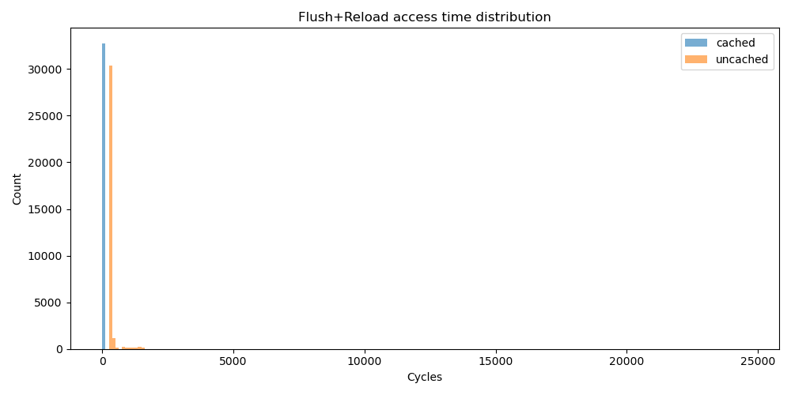

# Assignment 1: Flush+Reload

## Task 1 - Use mmap. (10%)

The implementation of `map` can be found in the file `task1.c` starting at line 10.

```c
void *map(char *file_name, uint64_t offset) {
    int fd = open(file_name, O_RDONLY);
    if (fd < 0) {
        printf("Cannot open file: %s\n", file_name);
        return NULL;
    }

    long page_size = sysconf(_SC_PAGESIZE);
    uint64_t page_base = offset & ~(page_size - 1);   // align offset to page
    uint64_t page_offset = offset - page_base;        // offset inside mapped page

    // Map exactly one page
    void *map_base = mmap(NULL, page_size, PROT_READ, MAP_PRIVATE, fd, page_base);
    close(fd);

    if (map_base == MAP_FAILED) {
        printf("mmap failed\n");
        return NULL;
    }

    return (char*)map_base + page_offset;
}
```

## Task 2 - Implement the Flush+Reload Function (10%)

The implementation of `flush_reload` can be found in the file `task2.c` starting at line 7.
The CLI wrapper implemented in `task2_test.c` was used to measure the access times of the file
`/etc/passwd` and wrote the measured times to `task2.csv`. The Pythom script `task2.py` was used
to create the following histogram of the access times.



CLI Usage:

```bash
❯ make task2
gcc -O0 -Wall -I. task2.c task2_test.c task1.c -o task2
❯ ./task2 /etc/passwd
Wrote task2.csv with 32768 samples.
❯ python task2.py
Cached:   mean=53.86, median=36.00, std=19.52, min=36, max=144
Uncached: mean=333.48, median=288.00, std=249.22, min=252, max=24588
Saved histogram to task2.png
```
