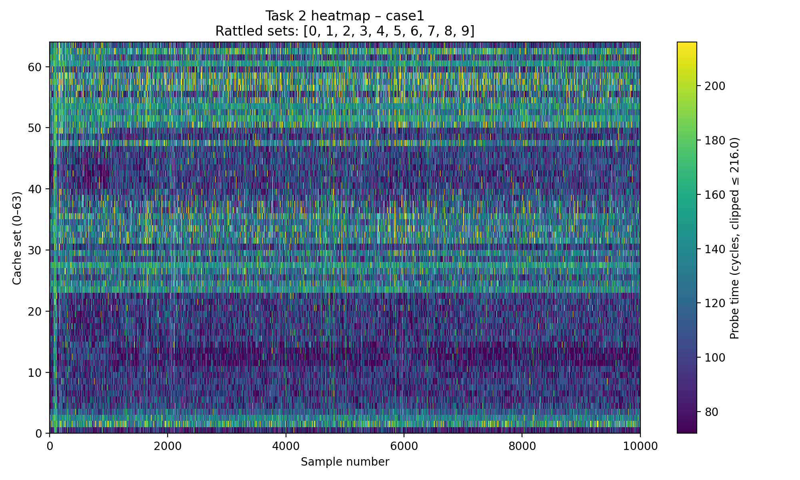
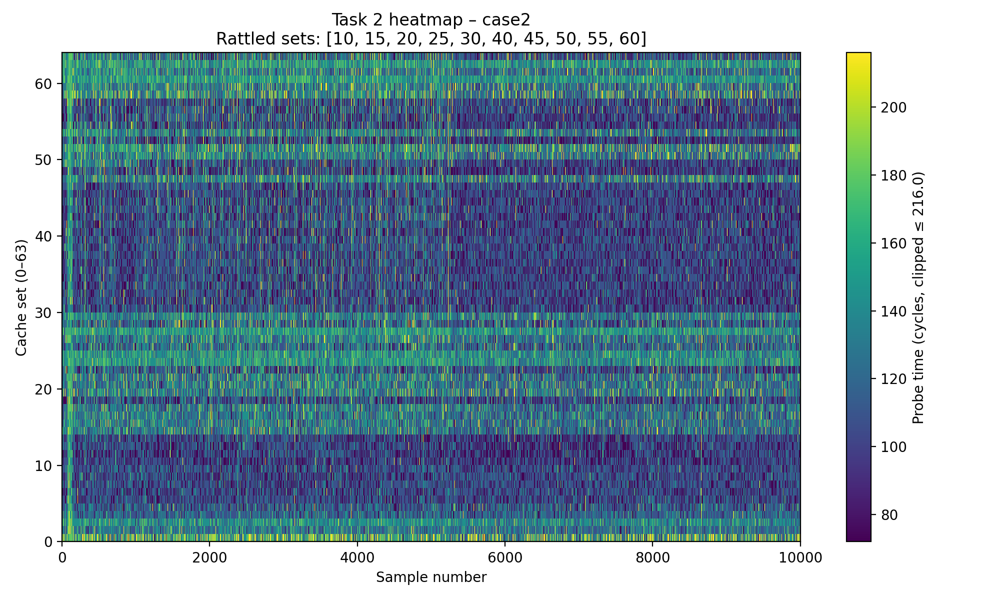
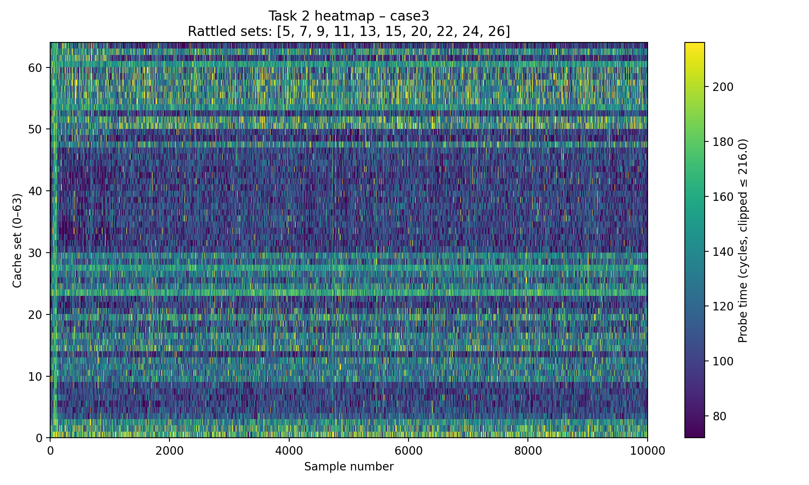

# Assignment 2 - Prime+Probe attack on AES

## Task 1 - L1-rattle with mmap (10%)

The goal of `task1_rattle_cache_sets` is to create cache activity only in user-selected L1 sets. The program first allocates a memory region via `mmap(MAP_PRIVATE | MAP_ANONYMOUS)` and groups addresses from that region into per-set “buckets” using the L1 set-index function (64-byte lines, 64 sets).

The rattle function then repeatedly accesses the addresses belonging to the requested sets:

```c
void task1_rattle_cache_sets(int n, const int *sets, uint32_t iterations) {
    volatile uint8_t sink = 0;

    for (uint32_t it = 0; it < iterations; it++) {
        for (int i = 0; i < n; i++) {
            int s = sets[i];
            if (s < 0 || s >= L1_SETS) {
                continue;
            }
            set_bucket_t *b = &g_buckets[s];
            for (size_t j = 0; j < b->count; j++) {
                sink ^= *b->addrs[j];
            }
        }
    }

    (void)sink;
}
```

Key points:

- `g_buckets[s]` contains pointers to addresses that map to cache set `s`.
- For each selected set, the code iterates over all addresses in that bucket and performs a load (`*b->addrs[j]`), which pulls the corresponding cache line into L1 and causes replacements within the same set once the set’s associativity is exceeded.
- `sink` is declared `volatile` and updated with `^=` so that the compiler cannot remove the loads under high optimization levels (`-O4`). The final `(void)sink;` prevents “unused variable” elimination.

It is a controlled “noise generator” that continuously brings lines in/out of the chosen sets, increasing miss probability for other lines that compete for the same sets.

## Task 2 - Prime+Rattle+Probe on all sets (30%)

### Prime

Priming fills each cache set with the attacker’s eviction-set lines. Each eviction set is a circular linked list with `L1_ASSOC` nodes, so traversing it performs `L1_ASSOC` dependent loads (pointer chasing), which avoids prefetcher help.

```c
__attribute__((noinline))
void task2_prime_all(void) {
    for (int s = 0; s < L1_SETS; s++) {
        volatile node_t *p = g_sets[s];
        for (int i = 0; i < L1_ASSOC; i++) {
            p = p->next;
        }
    }
}
```

- `volatile node_t *p` ensures the compiler emits the loads.
- `noinline` avoids aggressive inlining and transformations around the prime/probe steps.

### Rattle

Rattle is intended to simulate a victim evicting the attacker’s lines in selected sets:

```c
__attribute__((noinline))
void task2_rattle_cache_sets(int n, const int *sets, uint32_t iterations) {
    for (uint32_t it = 0; it < iterations; it++) {
        for (int i = 0; i < n; i++) {
            int s = sets[i];
            if (s < 0 || s >= L1_SETS) {
                continue;
            }
            volatile node_t *p = g_sets[s];
            for (int k = 0; k < L1_ASSOC; k++) {
                p = p->next;
            }
        }
    }
}
```

### Probe

Probe measures how expensive it is to traverse a set’s eviction list after priming and rattling:

```c
__attribute__((noinline))
uint64_t task2_probe_set(int set_index) {
    if (set_index < 0 || set_index >= L1_SETS) {
        return 0;
    }

    volatile node_t *p = g_sets[set_index];
    uint64_t start, end;
    unsigned hi, lo;

    asm volatile("mfence\n\tlfence\n\trdtsc\n\t"
                 "mov %%eax, %0\n\t"
                 "mov %%edx, %1\n\t"
                 "lfence"
                 : "=r"(lo), "=r"(hi)
                 :
                 : "%rax", "%rdx", "memory");
    start = ((uint64_t)hi << 32) | lo;

    for (int i = 0; i < L1_ASSOC; i++) {
        p = p->next;
    }

    asm volatile("lfence\n\trdtsc\n\t"
                 "mov %%eax, %0\n\t"
                 "mov %%edx, %1\n\t"
                 : "=r"(lo), "=r"(hi)
                 :
                 : "%rax", "%rdx", "memory");
    end = ((uint64_t)hi << 32) | lo;

    return end - start;
}
```

- The `mfence/lfence` + `"memory"` clobber serialize and prevent reordering across the timing window.
- The measurement is total traversal time over `L1_ASSOC` loads, not a single load.

### Typical probe times (hits vs misses)

In an ideal Prime+Probe lab setup:

- A “hit-like” probe (eviction set still in L1) should be clearly lower.
- A “miss-like” probe (evicted to L2/L3) should be clearly higher.
- Outliers (200+ cycles) usually come from interrupts, scheduler noise, frequency changes, or core migrations.

In my measurements, the probe times are mostly in a noisy band (roughly ~70–160 cycles) with frequent outliers >200 cycles, so the separation between “hit” and “miss” is not clean enough to create the expected bright horizontal stripes for the rattled sets.





### Why the attempted fixes still did not work (likely)

Even after strengthening fences and using `volatile/noinline`, the core problem remains: the “victim activity” is not truly evicting the attacker lines in a stable, set-specific way. On a shared system, scheduler jitter and interrupts can easily dominate the already small L1 timing differences, and without strong deterministic eviction pressure (separate competing lines and consistent core placement), the heatmap will remain noisy.

I was sadly not able to find a solution for that problem in time. :(

## Task 3 - First round attack on AES (30%)

### How the attack should work

A T-table AES implementation performs (conceptually) table lookups depending on:

- first round: `T[ plaintext[i] XOR round_key[i] ]`

Because cache lines group multiple table entries, monitoring which cache sets were accessed leaks partial information about `plaintext[i] XOR round_key[i]`. The assignment target is the upper nibble of each key byte.

Typical workflow:

1. For many samples:

   - Generate random plaintext.
   - Prime all sets.
   - Encrypt once.
   - Probe all sets and record timings.

2. Cluster samples by `plaintext[i] & 0xf0` for each byte index `i`.
3. Normalize timings per cache set (subtract a baseline mean) to reduce constant noise.
4. For each key-byte position:

   - Try all 16 possible upper-nibble guesses and all 64 possible “offsets”.
   - Score each guess by summing the timings of the predicted accessed cache sets.
   - Pick the guess with maximum score.

### Noise mitigation measures

The standard countermeasures against noise are:

- large sample sizes (100k),
- per-set baseline subtraction,
- outlier handling (clipping/percentile),
- core pinning to avoid L1 resets by migration.

### Observed result and why it is wrong

You tested 3 different keys, but the output is identical every time:

```text
66e94bd4ef8a2c3b884cfa59ca342b2e
```

This indicates that the Task 3 implementation did not actually recover key nibbles. So the accurency for all keys is zero percent.

Given that my task 2 implementation does not show a stable set-specific eviction signal, the most likely root cause is: **there is not enough usable leakage in the recorded cache timings**, so the key-recovery stage cannot correlate timings with plaintext classes. Without that correlation, the scoring tends to collapse to a constant “winner” driven by baseline bias.

## Task 4 - Last round attack on AES (30%)

### How the attack should work

The last round has a stronger property for cache attacks: for each byte position `i`,

- `ciphertext[i] = T[state[i]] XOR K10[i]`

Using ciphertext, we can test guesses of `K10[i]` directly. For a guess `k` and observed ciphertext byte `ct`, compute:

- `x = INV_SBOX[ct XOR k]`
- `line = x >> 4` (cache line index 0–15 for 16 lines of the table segment)
- `set = (offset + line) % 64`

Then sum the normalized timing for those predicted sets across all `ct` values. The correct guess should maximize the sum.

### Observed result and why it is wrong

Task 4 shows the same problem as Task 3: the output is identical for three different input keys:

```text
66e94bd4ef8a2c3b884cfa59ca342b2e
```

So the accurency for all keys is again zero percent.

Why the fixes did not succeed:

- The last-round attack relies on accurate mapping from T-table cache lines to L1 sets and on a consistent eviction signal.
- With a weak/noisy Prime+Probe baseline (Task 2), the ciphertext clustering will not produce meaningful per-set timing differences, and the score surface becomes flat/noisy. In that case, the “maximum” is effectively arbitrary but often stable across runs due to constant bias.

## The `run_all.sh`-Script

For simplicity, the script `run_all.sh` builds and executes all of tasks above.
The output is the baseline for all task solutions above.

```bash
❯ ./run_all.sh
------------------------------------------------------------
Build
------------------------------------------------------------
[i] Running make to build all task binaries
Build all targets
$ make
make task1
make[1]: Entering directory '/home/domai/Coding/microarchitectural-attacks-and-defenses-ws2526/assignment-02/solution'
gcc -O4 -Wall -I. ./task1/task1.c ./task1/task1_test.c  -o ./task1/task1.bin 2>/dev/null || \
gcc -O4 -Wall -I. ./task1/task1.c  -o ./task1/task1.bin
make[1]: Leaving directory '/home/domai/Coding/microarchitectural-attacks-and-defenses-ws2526/assignment-02/solution'
make task2
make[1]: Entering directory '/home/domai/Coding/microarchitectural-attacks-and-defenses-ws2526/assignment-02/solution'
gcc -O4 -Wall -I. ./task2/task2.c ./task2/task2_test.c  -o ./task2/task2.bin 2>/dev/null || \
gcc -O4 -Wall -I. ./task2/task2.c  -o ./task2/task2.bin
make[1]: Leaving directory '/home/domai/Coding/microarchitectural-attacks-and-defenses-ws2526/assignment-02/solution'
make task3
make[1]: Entering directory '/home/domai/Coding/microarchitectural-attacks-and-defenses-ws2526/assignment-02/solution'
gcc -O4 -Wall -I. ./task3/task3.c ./task3/task3_test.c ../material/AES/aes.c ../material/AES/aes_core.c -o ./task3/task3.bin 2>/dev/null || \
gcc -O4 -Wall -I. ./task3/task3.c ../material/AES/aes.c ../material/AES/aes_core.c -o ./task3/task3.bin
make[1]: Leaving directory '/home/domai/Coding/microarchitectural-attacks-and-defenses-ws2526/assignment-02/solution'
make task4
make[1]: Entering directory '/home/domai/Coding/microarchitectural-attacks-and-defenses-ws2526/assignment-02/solution'
gcc -O4 -Wall -I. ./task4/task4.c ./task4/task4_test.c ../material/AES/aes.c ../material/AES/aes_core.c -o ./task4/task4.bin 2>/dev/null || \
gcc -O4 -Wall -I. ./task4/task4.c ../material/AES/aes.c ../material/AES/aes_core.c -o ./task4/task4.bin
make[1]: Leaving directory '/home/domai/Coding/microarchitectural-attacks-and-defenses-ws2526/assignment-02/solution'

[✓] Build completed.
------------------------------------------------------------
Verify binaries
------------------------------------------------------------
[✓] Found executable: task1/task1.bin
[✓] Found executable: task2/task2.bin
[✓] Found executable: task3/task3.bin
[✓] Found executable: task4/task4.bin
------------------------------------------------------------
Task 1 – L1 rattle with mmap
------------------------------------------------------------
[i] Goal: Access addresses mapped to user-chosen L1 cache sets (no output required by assignment).
[i] Smoke test: rattle 3 sets.
Running Task 1: rattling sets 0 10 42
$ ./task1/task1.bin 3 0 10 42
Rattling 3 cache sets...
Done.

[✓] Task 1 executed successfully.
------------------------------------------------------------
Task 2 – Prime+Rattle+Probe + heatmaps
------------------------------------------------------------
[i] Goal: Prime all sets, rattle 10 chosen sets, probe all sets, and visualize cache activity as heatmaps.
[i] This uses task2/task2.py which runs multiple test cases itself and stores .dat/.png in task2/heatmaps/.
Running Task 2: generating raw traces and heatmaps (task2/heatmaps/*)
$ python3 task2/task2.py
Running task2.bin for case 'case1' with 10000 samples, rattled sets [0, 1, 2, 3, 4, 5, 6, 7, 8, 9]...
Saved raw data to ./task2/heatmaps/case1.dat
qt.qpa.wayland: No shell integration named "xdg-shell" found
qt.qpa.wayland: No shell integration named "wl-shell" found
qt.qpa.wayland: Loading shell integration failed.
qt.qpa.wayland: Attempted to load the following shells QList("xdg-shell", "wl-shell", "ivi-shell", "qt-shell")
qt.qpa.plugin: Could not load the Qt platform plugin "wayland" in "" even though it was found.
Saved heatmap to ./task2/heatmaps/case1.png
Running task2.bin for case 'case2' with 10000 samples, rattled sets [10, 15, 20, 25, 30, 40, 45, 50, 55, 60]...
Saved raw data to ./task2/heatmaps/case2.dat
Saved heatmap to ./task2/heatmaps/case2.png
Running task2.bin for case 'case3' with 10000 samples, rattled sets [5, 7, 9, 11, 13, 15, 20, 22, 24, 26]...
Saved raw data to ./task2/heatmaps/case3.dat
Saved heatmap to ./task2/heatmaps/case3.png

[✓] Task 2 executed successfully.
[i] Check outputs under: task2/heatmaps/
[i] Expected: case*.dat and case*.png
------------------------------------------------------------
Task 3 – First round AES attack (upper nibbles)
------------------------------------------------------------
[i] Goal: Recover upper 4 bits of each AES key byte via first-round Prime+Probe.
[i] Demo run with a known key.
Running Task 3: samples=100000, key=00112233445566778899aabbccddeeff (prints 16 hex digits)
$ ./task3/task3.bin 100000 00112233445566778899aabbccddeeff
66e94bd4ef8a2c3b884cfa59ca342b2e

Running Task 3: samples=100000, key=df7d3a13e080c27723feee1fac7b9c01 (prints 16 hex digits)
$ ./task3/task3.bin 100000 df7d3a13e080c27723feee1fac7b9c01
66e94bd4ef8a2c3b884cfa59ca342b2e

Running Task 3: samples=100000, key=e62e42c48cd0fc1ab93b5be24725d5b7 (prints 16 hex digits)
$ ./task3/task3.bin 100000 e62e42c48cd0fc1ab93b5be24725d5b7
66e94bd4ef8a2c3b884cfa59ca342b2e

[✓] Task 3 executed successfully.
------------------------------------------------------------
Task 4 – Last round AES attack (recover K10)
------------------------------------------------------------
[i] Goal: Recover full last-round key K10 bytes via ciphertext clustering and INV_SBOX model.
[i] Demo run with the same key.
Running Task 4: samples=100000, key=00112233445566778899aabbccddeeff (prints recovered K10 / accuracy)
$ ./task4/task4.bin 100000 00112233445566778899aabbccddeeff
66e94bd4ef8a2c3b884cfa59ca342b2e

Running Task 4: samples=100000, key=df7d3a13e080c27723feee1fac7b9c01 (prints recovered K10 / accuracy)
$ ./task4/task4.bin 100000 df7d3a13e080c27723feee1fac7b9c01
66e94bd4ef8a2c3b884cfa59ca342b2e

Running Task 4: samples=100000, key=e62e42c48cd0fc1ab93b5be24725d5b7 (prints recovered K10 / accuracy)
$ ./task4/task4.bin 100000 e62e42c48cd0fc1ab93b5be24725d5b7
66e94bd4ef8a2c3b884cfa59ca342b2e

[✓] Task 4 executed successfully.
```
