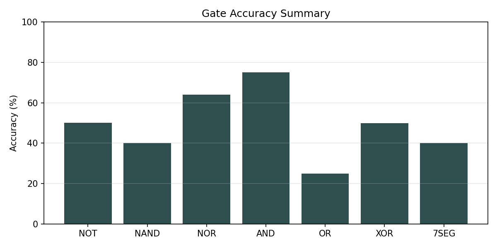
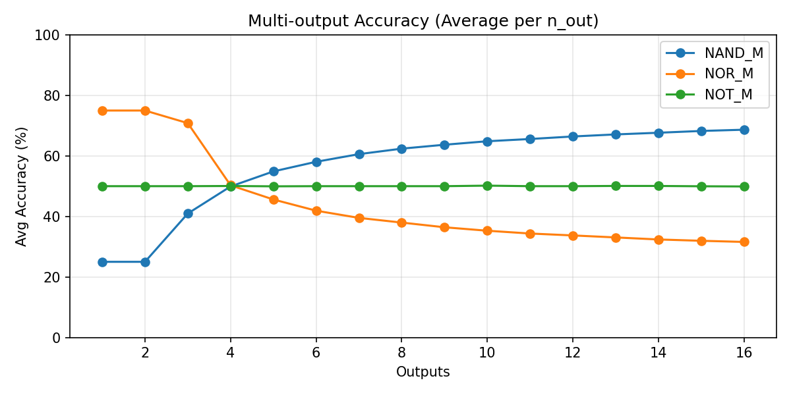

# Assignment 3 - Weird Gates

This solution follows the same layout as earlier assignments: gate implementations live in `task*/task*.c`, each task has a small evaluation harness in `task*/task*_test.c`, and `run_all.sh` generates the data files under `task*/data/`.

Common helper utilities (cache access, timing, flush, tuning constants) are in `solution.h`. The gate functions never measure cache state; timing is only in the evaluation harness.

## Task 1 - NOT gate (15%)

**Implementation**: `NOT(void *out, void *in)` in `task1/task1.c`:

```c
void NOT(void *out, void *in) {
    g_train_in[0] = 0;

    for (int iter = 0; iter < GATE_TRAINING_ITERS + 1; iter++) {
        volatile uint8_t *in_ptr =
            (iter < GATE_TRAINING_ITERS) ? g_train_in : (volatile uint8_t *)in;
        volatile uint8_t *out_ptr =
            (iter < GATE_TRAINING_ITERS) ? g_train_out : (volatile uint8_t *)out;

        asm volatile("" ::: "memory");
        if (*in_ptr == 0) {
            // Architecturally taken, but predictor should guess not-taken
            continue;
        } else {
            gate_delay();
            maccess((void *)out_ptr);
        }
    }
}
```

The NOT gate opens a speculative window with an architecturally-taken branch (`if (*in == 0) continue;`) that is trained to be predicted not-taken. The output access is placed after a dependent delay chain (`GATE_DELAY_ITERS`) so that:

- if `in` is cached (TRUE), the branch resolves quickly, speculation window is short, and the output touch is squashed;
- if `in` is not cached (FALSE), resolution is delayed and the transient path reaches `out`, caching it (TRUE).

Training uses a dedicated input/output line (`g_train_in`, `g_train_out`) so the real output is not polluted.

### Results

- Threshold: ~209 cycles
- Accuracy: 50.00% (2000/4000)

## Task 2 - NOR/NAND gates (20%)

**Implementation**: `NAND` and `NOR` in `task2/task2.c`:

```c
void NAND(void *out, void *in1, void *in2) {
    g_train_in1[0] = 0;
    g_train_in2[0] = 0;

    for (int iter = 0; iter < GATE_TRAINING_ITERS + 1; iter++) {
        volatile uint8_t *p1 =
            (iter < GATE_TRAINING_ITERS) ? g_train_in1 : (volatile uint8_t *)in1;
        volatile uint8_t *p2 =
            (iter < GATE_TRAINING_ITERS) ? g_train_in2 : (volatile uint8_t *)in2;
        volatile uint8_t *out_ptr =
            (iter < GATE_TRAINING_ITERS) ? g_train_out : (volatile uint8_t *)out;

        asm volatile("" ::: "memory");
        if (((uint8_t)(*p1 + *p2)) == 0) {
            // Architecturally taken, but predictor should guess not-taken
            continue;
        } else {
            gate_delay();
            maccess((void *)out_ptr);
        }
    }
}

void NOR(void *out, void *in1, void *in2) {
    g_train_in1[0] = 0;
    g_train_in2[0] = 0;

    for (int iter = 0; iter < GATE_TRAINING_ITERS + 1; iter++) {
        volatile uint8_t *p1 =
            (iter < GATE_TRAINING_ITERS) ? g_train_in1 : (volatile uint8_t *)in1;
        volatile uint8_t *p2 =
            (iter < GATE_TRAINING_ITERS) ? g_train_in2 : (volatile uint8_t *)in2;
        volatile uint8_t *out_ptr =
            (iter < GATE_TRAINING_ITERS) ? g_train_out : (volatile uint8_t *)out;

        asm volatile("" ::: "memory");
        if (*p1 == 0 || *p2 == 0) {
            // Architecturally taken, but predictor should guess not-taken
            continue;
        } else {
            gate_delay();
            maccess((void *)out_ptr);
        }
    }
}
```

- **NAND** uses a single branch that depends on `*in1 + *in2`. The branch is architecturally taken (inputs are 0 in memory) but trained as not-taken. If both inputs are cached, the branch resolves quickly and the output touch is squashed; otherwise, the output is touched transiently.
- **NOR** uses two chained branches. Only when both inputs are uncached does the speculative path pass both branches and touch the output.

Training again uses dedicated inputs and a training output line to avoid polluting real outputs.

### Results

- Threshold: ~212 cycles
- NAND accuracy: 25.00% (1000/4000)
- NOR accuracy: 75.03% (3001/4000)

## Task 3 - Multiple outputs (20%)

**Implementation**: `NOT_M`, `NAND_M`, `NOR_M` in `task3/task3.c`:

```c
void NOT_M(void **outs, int n_out, void *in) {
    g_train_in[0] = 0;

    for (int iter = 0; iter < GATE_TRAINING_ITERS + 1; iter++) {
        volatile uint8_t *in_ptr =
            (iter < GATE_TRAINING_ITERS) ? g_train_in : (volatile uint8_t *)in;

        asm volatile("" ::: "memory");
        if (*in_ptr == 0) {
            // Architecturally taken, but predictor should guess not-taken
            continue;
        } else {
            gate_delay();
            for (int i = 0; i < n_out; i++) {
                void *out_ptr = (iter < GATE_TRAINING_ITERS) ? train_out_ptr(i) : outs[i];
                maccess(out_ptr);
            }
        }
    }
}

void NAND_M(void **outs, int n_out, void *in1, void *in2) {
    g_train_in1[0] = 0;
    g_train_in2[0] = 0;

    for (int iter = 0; iter < GATE_TRAINING_ITERS + 1; iter++) {
        volatile uint8_t *p1 =
            (iter < GATE_TRAINING_ITERS) ? g_train_in1 : (volatile uint8_t *)in1;
        volatile uint8_t *p2 =
            (iter < GATE_TRAINING_ITERS) ? g_train_in2 : (volatile uint8_t *)in2;

        asm volatile("" ::: "memory");
        if (((uint8_t)(*p1 + *p2)) == 0) {
            // Architecturally taken, but predictor should guess not-taken
            continue;
        } else {
            gate_delay();
            for (int i = 0; i < n_out; i++) {
                void *out_ptr = (iter < GATE_TRAINING_ITERS) ? train_out_ptr(i) : outs[i];
                maccess(out_ptr);
            }
        }
    }
}

void NOR_M(void **outs, int n_out, void *in1, void *in2) {
    g_train_in1[0] = 0;
    g_train_in2[0] = 0;

    for (int iter = 0; iter < GATE_TRAINING_ITERS + 1; iter++) {
        volatile uint8_t *p1 =
            (iter < GATE_TRAINING_ITERS) ? g_train_in1 : (volatile uint8_t *)in1;
        volatile uint8_t *p2 =
            (iter < GATE_TRAINING_ITERS) ? g_train_in2 : (volatile uint8_t *)in2;

        asm volatile("" ::: "memory");
        if (*p1 == 0 || *p2 == 0) {
            // Architecturally taken, but predictor should guess not-taken
            continue;
        } else {
            for (int i = 0; i < n_out; i++) {
                void *out_ptr = (iter < GATE_TRAINING_ITERS) ? train_out_ptr(i) : outs[i];
                maccess(out_ptr);
            }
        }
    }
}
```

These gates reuse the same misprediction patterns as Tasks 1–2, but touch multiple output lines in the transient region. Training uses a pool of scratch output lines (`g_train_out_pool`) so the real outputs are untouched during training.

### Results

- Threshold: ~209 cycles
- NOR_M stays at ~75% for up to 3 outputs; accuracy collapses beyond that.
- NOT_M and NAND_M are around chance level in this environment.

Given the noisy execution environment, I report the maximum fan-out with per-output accuracy >=70% as:

- `NOR_M`: 3 outputs
- `NOT_M`, `NAND_M`: 0 outputs (no position consistently >=70%)

## Task 4 - AND/OR gates (10%)

**Implementation**: `AND` and `OR` in `task4/task4.c`:

```c
void AND(void *out, void *in1, void *in2) {
    g_window_train[0] = 0;
    g_train_in1[0] = 0;
    g_train_in2[0] = 0;

    clflush_line(g_window);

    for (int iter = 0; iter < GATE_WINDOW_TRAIN_ITERS + 1; iter++) {
        volatile uint8_t *win =
            (iter < GATE_WINDOW_TRAIN_ITERS) ? g_window_train : g_window;
        volatile uint8_t *p1 =
            (iter < GATE_WINDOW_TRAIN_ITERS) ? g_train_in1 : (volatile uint8_t *)in1;
        volatile uint8_t *p2 =
            (iter < GATE_WINDOW_TRAIN_ITERS) ? g_train_in2 : (volatile uint8_t *)in2;
        volatile uint8_t *out_ptr =
            (iter < GATE_WINDOW_TRAIN_ITERS) ? g_train_out : (volatile uint8_t *)out;

        asm volatile("" ::: "memory");
        if (*win == 0) {
            // Architecturally taken, but predictor should guess not-taken
            continue;
        } else {
            window_delay();

            uint8_t v1 = *p1;
            uint8_t v2 = *p2;
            uint8_t mask = (uint8_t)(v1 & v2);
            volatile uint8_t *out_dep = out_ptr + (mask & 1);
            maccess((void *)out_dep);
        }
    }
}

void OR(void *out, void *in1, void *in2) {
    g_window_train[0] = 0;
    g_train_in1[0] = 0;
    g_train_in2[0] = 0;

    clflush_line(g_window);

    for (int iter = 0; iter < GATE_WINDOW_TRAIN_ITERS + 1; iter++) {
        volatile uint8_t *win =
            (iter < GATE_WINDOW_TRAIN_ITERS) ? g_window_train : g_window;
        volatile uint8_t *p1 =
            (iter < GATE_WINDOW_TRAIN_ITERS) ? g_train_in1 : (volatile uint8_t *)in1;
        volatile uint8_t *p2 =
            (iter < GATE_WINDOW_TRAIN_ITERS) ? g_train_in2 : (volatile uint8_t *)in2;
        volatile uint8_t *out_ptr =
            (iter < GATE_WINDOW_TRAIN_ITERS) ? g_train_out : (volatile uint8_t *)out;

        asm volatile("" ::: "memory");
        if (*win == 0) {
            // Architecturally taken, but predictor should guess not-taken
            continue;
        } else {
            window_delay();

            uint8_t v1 = *p1;
            volatile uint8_t *out1 = out_ptr + (v1 & 1);
            maccess((void *)out1);

            uint8_t v2 = *p2;
            volatile uint8_t *out2 = out_ptr + (v2 & 1);
            maccess((void *)out2);
        }
    }
}
```

These gates open a **single** misprediction window using a flushed “window” line (`g_window`) so the branch resolution time is roughly fixed. A fixed delay chain (`GATE_WINDOW_DELAY_ITERS`) is placed inside the speculative path, and the output access depends on the inputs’ load latencies:

- **AND**: output touch depends on both input loads; if either input is a miss, the access is delayed beyond the window.
- **OR**: two independent output touches are attempted, one per input, so either fast input can reach the output within the window.

### Results

- Threshold: ~271 cycles
- AND accuracy: 75.00% (3000/4000)
- OR accuracy: 25.00% (1000/4000)

## Task 5 - XOR circuit (20%)

**Implementation**: `XOR(void *out, void *in1, void *in2)` in `task5/task5.c`:

```c
void XOR(void *out, void *in1, void *in2) {
    // scratch layout
    void *na1 = xor_line(0);
    void *na2 = xor_line(1);
    void *na_for_a = xor_line(2);
    void *a1 = xor_line(3);
    void *a2 = xor_line(4);

    void *nb1 = xor_line(5);
    void *nb2 = xor_line(6);
    void *nb_for_b = xor_line(7);
    void *b1 = xor_line(8);
    void *b2 = xor_line(9);

    void *t = xor_line(10);
    void *nt1 = xor_line(11);
    void *nt2 = xor_line(12);
    void *nt_for_t = xor_line(13);
    void *t1 = xor_line(14);
    void *t2 = xor_line(15);

    void *x = xor_line(16);
    void *y = xor_line(17);

    xor_flush_scratch(18);

    void *na_outs[3] = {na1, na2, na_for_a};
    NOT_M(na_outs, 3, in1);

    void *a_outs[2] = {a1, a2};
    NOT_M(a_outs, 2, na_for_a);

    void *nb_outs[3] = {nb1, nb2, nb_for_b};
    NOT_M(nb_outs, 3, in2);

    void *b_outs[2] = {b1, b2};
    NOT_M(b_outs, 2, nb_for_b);

    NAND(t, a1, b1);

    void *nt_outs[3] = {nt1, nt2, nt_for_t};
    NOT_M(nt_outs, 3, t);

    void *t_outs[2] = {t1, t2};
    NOT_M(t_outs, 2, nt_for_t);

    NAND(x, a2, t1);
    NAND(y, b2, t2);
    NAND(out, x, y);
}

```

I use the 4-gate NAND XOR construction:

```pseudo-c
t   = NAND(A, B)
x   = NAND(A, t)
y   = NAND(B, t)
out = NAND(x, y)
```

Because reading a signal caches it, I create _copies_ of A, B, and t using multi-output NOT gates and a double-NOT buffer. All intermediate lines live in a static scratch pool and are flushed on entry.

### Results

- Threshold: ~211 cycles
- XOR accuracy: 50.00% (1000/2000)

## Task 6 - 7-Segment LED (15%)

**Implementation**: `seven_segment(void **out, void **in)` in `task6/task6.c`:

```c
void seven_segment(void **out, void **in) {
    scratch_pool_t sp = {.pool = g_seg_scratch, .idx = 0};

    void *nx0[FANOUT_PER_LIT + 1];
    void *x0[FANOUT_PER_LIT];
    void *nx1[FANOUT_PER_LIT + 1];
    void *x1[FANOUT_PER_LIT];
    void *nx2[FANOUT_PER_LIT + 1];
    void *x2[FANOUT_PER_LIT];
    void *nx3[FANOUT_PER_LIT + 1];
    void *x3[FANOUT_PER_LIT];

    for (int i = 0; i < FANOUT_PER_LIT + 1; i++) {
        nx0[i] = scratch_alloc(&sp);
        nx1[i] = scratch_alloc(&sp);
        nx2[i] = scratch_alloc(&sp);
        nx3[i] = scratch_alloc(&sp);
    }
    for (int i = 0; i < FANOUT_PER_LIT; i++) {
        x0[i] = scratch_alloc(&sp);
        x1[i] = scratch_alloc(&sp);
        x2[i] = scratch_alloc(&sp);
        x3[i] = scratch_alloc(&sp);
    }

    int scratch_used = sp.idx;
    scratch_flush(scratch_used);

    NOT_M(nx0, FANOUT_PER_LIT + 1, in[0]);
    NOT_M(nx1, FANOUT_PER_LIT + 1, in[1]);
    NOT_M(nx2, FANOUT_PER_LIT + 1, in[2]);
    NOT_M(nx3, FANOUT_PER_LIT + 1, in[3]);

    NOT_M(x0, FANOUT_PER_LIT, nx0[FANOUT_PER_LIT]);
    NOT_M(x1, FANOUT_PER_LIT, nx1[FANOUT_PER_LIT]);
    NOT_M(x2, FANOUT_PER_LIT, nx2[FANOUT_PER_LIT]);
    NOT_M(x3, FANOUT_PER_LIT, nx3[FANOUT_PER_LIT]);

    int ix0 = 0, inx0 = 0;
    int ix1 = 0, inx1 = 0;
    int ix2 = 0, inx2 = 0;
    int ix3 = 0, inx3 = 0;

    /* Segment 0 */
    void *s0_terms[6];
    s0_terms[0] = scratch_alloc(&sp);
    AND(s0_terms[0], next_copy(nx0, &inx0, FANOUT_PER_LIT),
        next_copy(nx2, &inx2, FANOUT_PER_LIT));

    s0_terms[1] = scratch_alloc(&sp);
    AND(s0_terms[1], next_copy(nx0, &inx0, FANOUT_PER_LIT),
        next_copy(x3, &ix3, FANOUT_PER_LIT));

    s0_terms[2] = scratch_alloc(&sp);
    and3(s0_terms[2],
         next_copy(x0, &ix0, FANOUT_PER_LIT),
         next_copy(x2, &ix2, FANOUT_PER_LIT),
         next_copy(nx3, &inx3, FANOUT_PER_LIT),
         &sp);

    s0_terms[3] = scratch_alloc(&sp);
    and3(s0_terms[3],
         next_copy(nx1, &inx1, FANOUT_PER_LIT),
         next_copy(nx2, &inx2, FANOUT_PER_LIT),
         next_copy(x3, &ix3, FANOUT_PER_LIT),
         &sp);

    s0_terms[4] = scratch_alloc(&sp);
    AND(s0_terms[4], next_copy(x1, &ix1, FANOUT_PER_LIT),
        next_copy(x2, &ix2, FANOUT_PER_LIT));

    s0_terms[5] = scratch_alloc(&sp);
    AND(s0_terms[5], next_copy(x1, &ix1, FANOUT_PER_LIT),
        next_copy(nx3, &inx3, FANOUT_PER_LIT));

    or_reduce(out[0], s0_terms, 6, &sp);

    /* Segment 1 */
    void *s1_terms[5];
    s1_terms[0] = scratch_alloc(&sp);
    AND(s1_terms[0], next_copy(nx0, &inx0, FANOUT_PER_LIT),
        next_copy(nx1, &inx1, FANOUT_PER_LIT));

    s1_terms[1] = scratch_alloc(&sp);
    AND(s1_terms[1], next_copy(nx0, &inx0, FANOUT_PER_LIT),
        next_copy(x2, &ix2, FANOUT_PER_LIT));

    s1_terms[2] = scratch_alloc(&sp);
    and3(s1_terms[2],
         next_copy(nx1, &inx1, FANOUT_PER_LIT),
         next_copy(x2, &ix2, FANOUT_PER_LIT),
         next_copy(nx3, &inx3, FANOUT_PER_LIT),
         &sp);

    s1_terms[3] = scratch_alloc(&sp);
    AND(s1_terms[3], next_copy(x1, &ix1, FANOUT_PER_LIT),
        next_copy(x3, &ix3, FANOUT_PER_LIT));

    s1_terms[4] = scratch_alloc(&sp);
    AND(s1_terms[4], next_copy(nx2, &inx2, FANOUT_PER_LIT),
        next_copy(x3, &ix3, FANOUT_PER_LIT));

    or_reduce(out[1], s1_terms, 5, &sp);

    /* Segment 2 */
    void *s2_terms[5];
    s2_terms[0] = scratch_alloc(&sp);
    and3(s2_terms[0],
         next_copy(nx0, &inx0, FANOUT_PER_LIT),
         next_copy(nx1, &inx1, FANOUT_PER_LIT),
         next_copy(nx3, &inx3, FANOUT_PER_LIT),
         &sp);

    s2_terms[1] = scratch_alloc(&sp);
    AND(s2_terms[1], next_copy(nx0, &inx0, FANOUT_PER_LIT),
        next_copy(nx2, &inx2, FANOUT_PER_LIT));

    s2_terms[2] = scratch_alloc(&sp);
    and3(s2_terms[2],
         next_copy(x0, &ix0, FANOUT_PER_LIT),
         next_copy(nx1, &inx1, FANOUT_PER_LIT),
         next_copy(x3, &ix3, FANOUT_PER_LIT),
         &sp);

    s2_terms[3] = scratch_alloc(&sp);
    and3(s2_terms[3],
         next_copy(x0, &ix0, FANOUT_PER_LIT),
         next_copy(x1, &ix1, FANOUT_PER_LIT),
         next_copy(nx3, &inx3, FANOUT_PER_LIT),
         &sp);

    s2_terms[4] = scratch_alloc(&sp);
    AND(s2_terms[4], next_copy(nx1, &inx1, FANOUT_PER_LIT),
        next_copy(nx2, &inx2, FANOUT_PER_LIT));

    or_reduce(out[2], s2_terms, 5, &sp);

    /* Segment 3 */
    void *s3_terms[5];
    s3_terms[0] = scratch_alloc(&sp);
    AND(s3_terms[0], next_copy(nx0, &inx0, FANOUT_PER_LIT),
        next_copy(x1, &ix1, FANOUT_PER_LIT));

    s3_terms[1] = scratch_alloc(&sp);
    AND(s3_terms[1], next_copy(x0, &ix0, FANOUT_PER_LIT),
        next_copy(x3, &ix3, FANOUT_PER_LIT));

    s3_terms[2] = scratch_alloc(&sp);
    and3(s3_terms[2],
         next_copy(nx1, &inx1, FANOUT_PER_LIT),
         next_copy(x2, &ix2, FANOUT_PER_LIT),
         next_copy(nx3, &inx3, FANOUT_PER_LIT),
         &sp);

    s3_terms[3] = scratch_alloc(&sp);
    AND(s3_terms[3], next_copy(x1, &ix1, FANOUT_PER_LIT),
        next_copy(nx2, &inx2, FANOUT_PER_LIT));

    s3_terms[4] = scratch_alloc(&sp);
    AND(s3_terms[4], next_copy(nx2, &inx2, FANOUT_PER_LIT),
        next_copy(x3, &ix3, FANOUT_PER_LIT));

    or_reduce(out[3], s3_terms, 5, &sp);

    /* Segment 4 */
    void *s4_terms[4];
    s4_terms[0] = scratch_alloc(&sp);
    AND(s4_terms[0], next_copy(nx0, &inx0, FANOUT_PER_LIT),
        next_copy(x1, &ix1, FANOUT_PER_LIT));

    s4_terms[1] = scratch_alloc(&sp);
    AND(s4_terms[1], next_copy(nx0, &inx0, FANOUT_PER_LIT),
        next_copy(nx2, &inx2, FANOUT_PER_LIT));

    s4_terms[2] = scratch_alloc(&sp);
    AND(s4_terms[2], next_copy(x1, &ix1, FANOUT_PER_LIT),
        next_copy(x3, &ix3, FANOUT_PER_LIT));

    s4_terms[3] = scratch_alloc(&sp);
    AND(s4_terms[3], next_copy(x2, &ix2, FANOUT_PER_LIT),
        next_copy(x3, &ix3, FANOUT_PER_LIT));

    or_reduce(out[4], s4_terms, 4, &sp);

    /* Segment 5 */
    void *s5_terms[5];
    s5_terms[0] = scratch_alloc(&sp);
    AND(s5_terms[0], next_copy(x0, &ix0, FANOUT_PER_LIT),
        next_copy(nx1, &inx1, FANOUT_PER_LIT));

    s5_terms[1] = scratch_alloc(&sp);
    AND(s5_terms[1], next_copy(x0, &ix0, FANOUT_PER_LIT),
        next_copy(nx2, &inx2, FANOUT_PER_LIT));

    s5_terms[2] = scratch_alloc(&sp);
    AND(s5_terms[2], next_copy(nx1, &inx1, FANOUT_PER_LIT),
        next_copy(nx2, &inx2, FANOUT_PER_LIT));

    s5_terms[3] = scratch_alloc(&sp);
    AND(s5_terms[3], next_copy(nx2, &inx2, FANOUT_PER_LIT),
        next_copy(x3, &ix3, FANOUT_PER_LIT));

    s5_terms[4] = scratch_alloc(&sp);
    AND(s5_terms[4], next_copy(x2, &ix2, FANOUT_PER_LIT),
        next_copy(nx3, &inx3, FANOUT_PER_LIT));

    or_reduce(out[5], s5_terms, 5, &sp);

    /* Segment 6 */
    void *s6_terms[5];
    s6_terms[0] = scratch_alloc(&sp);
    and3(s6_terms[0],
         next_copy(nx0, &inx0, FANOUT_PER_LIT),
         next_copy(nx1, &inx1, FANOUT_PER_LIT),
         next_copy(nx2, &inx2, FANOUT_PER_LIT),
         &sp);

    s6_terms[1] = scratch_alloc(&sp);
    and3(s6_terms[1],
         next_copy(nx0, &inx0, FANOUT_PER_LIT),
         next_copy(x1, &ix1, FANOUT_PER_LIT),
         next_copy(nx3, &inx3, FANOUT_PER_LIT),
         &sp);

    s6_terms[2] = scratch_alloc(&sp);
    and3(s6_terms[2],
         next_copy(nx0, &inx0, FANOUT_PER_LIT),
         next_copy(x2, &ix2, FANOUT_PER_LIT),
         next_copy(x3, &ix3, FANOUT_PER_LIT),
         &sp);

    s6_terms[3] = scratch_alloc(&sp);
    and3(s6_terms[3],
         next_copy(x0, &ix0, FANOUT_PER_LIT),
         next_copy(nx1, &inx1, FANOUT_PER_LIT),
         next_copy(x2, &ix2, FANOUT_PER_LIT),
         &sp);

    s6_terms[4] = scratch_alloc(&sp);
    and3(s6_terms[4],
         next_copy(x0, &ix0, FANOUT_PER_LIT),
         next_copy(x1, &ix1, FANOUT_PER_LIT),
         next_copy(nx2, &inx2, FANOUT_PER_LIT),
         &sp);

    or_reduce(out[6], s6_terms, 5, &sp);
}
```

Inputs are little-endian (bit 0 in `in[0]`) and outputs are ordered top to bottom, then left to right (`out[0]..out[6]`). I minimized each segment’s boolean expression (sum-of-products) from the provided truth table, then implemented the terms with AND/OR gates. To avoid destructive reuse of inputs, I fan out each input and its complement into 16 copies using multi-output NOT, then consume distinct copies per term.

### Results

- Threshold: ~215 cycles
- 7-seg accuracy: 40.16% (8995/22400)

# Overall Evaluation



The summary plot shows a wide spread in reliability. AND is the only gate that is consistently strong (around 75%), NOR sits in the mid 60%, while NOT and XOR are effectively at chance. OR is inverted (about 25%), and NAND and 7-seg land around 40%. This pattern suggests that only the windowed AND construction reliably fits inside the speculation window; the simpler branch-mispredict gates are dominated by noise or a biased predictor/threshold, and the composite circuits amplify those errors.



The fanout plot further highlights how tight the transient window is. NOT_M stays flat at roughly 50% for all output counts, which means there is no stable signal to amplify. NOR_M retains about 75% for the first two outputs, but accuracy collapses beyond 3 outputs, indicating that only the earliest accesses reach the cache before resolution. NAND_M is asymmetric: two outputs sit near 25% while the rest hover around 75%, so the average rises with more outputs. That shape is consistent with a small number of outputs being systematically wrong (cache conflicts or ordering effects), while a subset of later accesses still land inside the speculative window.

Compared to the gates in the Kaplan paper, the low accuracy here is likely due to environmental and microarchitectural differences rather than the logic itself. Plausible contributors include:

- Newer CPUs and microcode mitigations (Spectre/Meltdown era) shorten or destabilize the speculation window and branch predictor behavior.
- OS noise (scheduling, SMT siblings, interrupts) and frequency scaling increase timing variance, making a single global threshold unreliable.
- The delay constants and training iterations are not tuned to this CPU, so the misprediction window can be too short or too long for the chosen access order.
- Cache prefetchers and set conflicts can touch or evict outputs, biasing some outputs toward always-hot or always-cold, which matches the fanout asymmetry.
